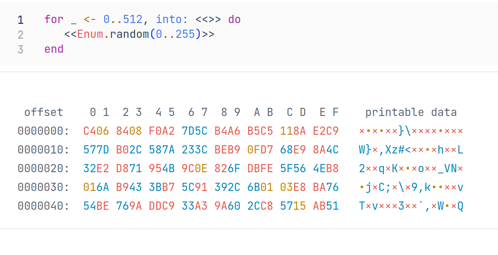
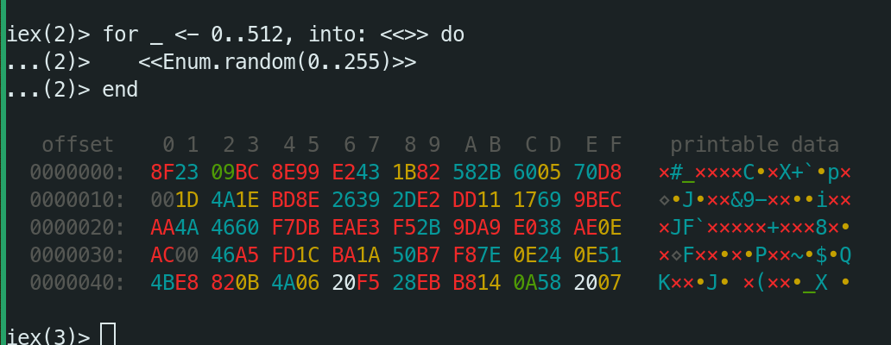

# Hexdump

  Docs can be found on [hexdocs](https://hexdocs.pm/hexdump)

  Hexdump makes it easier to work with binary data.

  By default elixir display binaries as a list of integers in the range from 0..255.

  This make it problematic to spot binary patterns.

  example binary:
  ```
  term = <<0,1,2,3,4>> <> "123abcdefxyz" <> <<253,254,255>>
  ```

  ```
  <<0, 1, 2, 3, 4, 49, 50, 51, 97, 98, 99, 100, 101, 102, 120, 121, 122, 253, 254,
  255>>
  ```

  You can pass a param to IO.inspect(term, base: :hex) to print the same term as hex,
  this makes it a bit easier to decipher.

  ```
  <<0x0, 0x1, 0x2, 0x3, 0x4, 0x31, 0x32, 0x33, 0x61, 0x62, 0x63, 0x64, 0x65, 0x66,
  0x78, 0x79, 0x7A, 0xFD, 0xFE, 0xFF>>
  ```

  With Hexdump you can see similar output like in hex editors

  
  

  You can switch between hexdump output by calling:

  ```
  Hexdump.on()
  Hexdump.off()
  Hexdump.on(binaries: :infer)
  Hexdump.on(binaries: :as_strings)
  ```

## Installation

If [available in Hex](https://hex.pm/docs/publish), the package can be installed
by adding `hexdump` to your list of dependencies in `mix.exs`:

```elixir
def deps do
  [
    {:hexdump, "~> 0.1.0"}
  ]
end
```


